## 在 AIGems 中使用交互式建模

### 目标

本文主要演示在AIGems中使用交互式建模服务来在平台中对[Cidar](https://www.cs.toronto.edu/~kriz/cifar.html)项目进行演示开发流程和开发验证一个简单推理服务

>  CIFAR-10是一个更接近普适物体的彩色图像数据集。CIFAR-10 是由Hinton 的学生Alex Krizhevsky 和Ilya Sutskever 整理的一个用于识别普适物体的小型数据集。一共包含10 个类别的RGB 彩色图片：飞机（ airplane ）、汽车（ automobile ）、鸟类（ bird ）、猫（ cat ）、鹿（ deer ）、狗（ dog ）、蛙类（ frog ）、马（ horse ）、船（ ship ）和卡车（ truck ）。每个图片的尺寸为32 × 32 ，每个类别有6000个图像，数据集中一共有50000 张训练图片和10000 张测试图片。

文中所有的代码和资源均保存在 https://github.com/kubegems/OpenGems-tutorials/tree/main/AIGems/im 仓库内

### 第一步 创建工作空间

这一步主要作用创建个人空间，用于保存开发环境以及保存研究过程中的数据

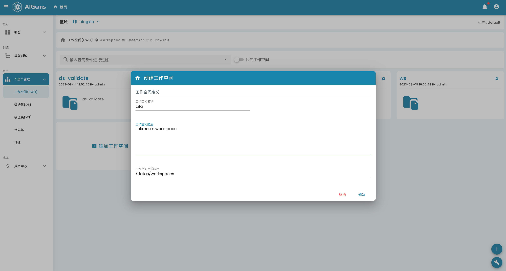

### 第二步 创建交互式建模实例

- 设置实例规格
  
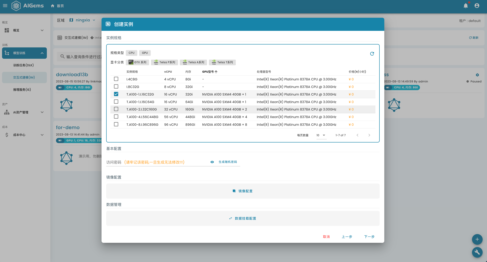

- 设置jupyter notebook镜像

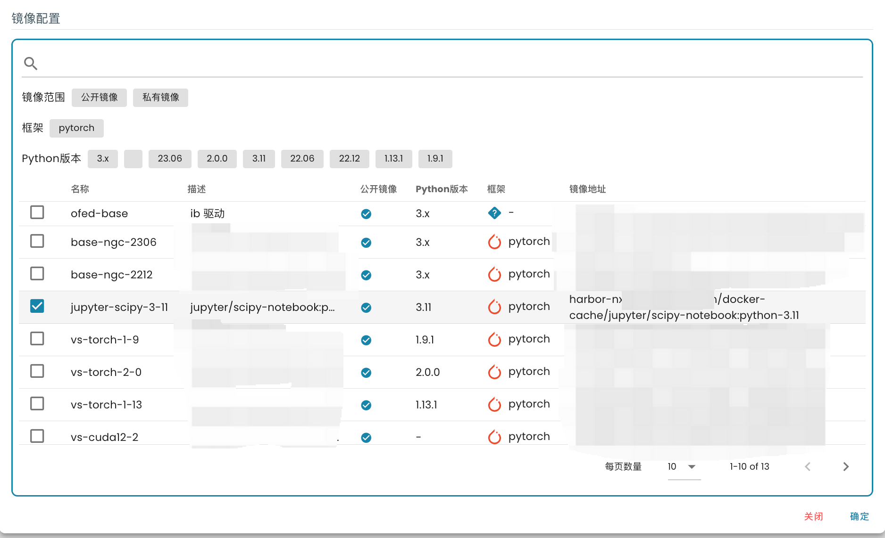

- 挂载个人空间

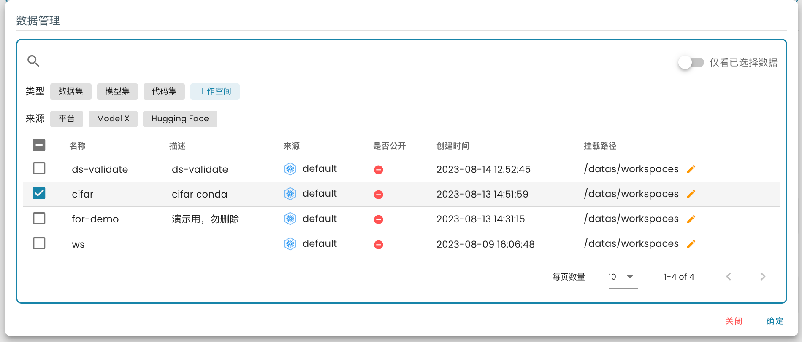

最终设置完成后，参考如下图

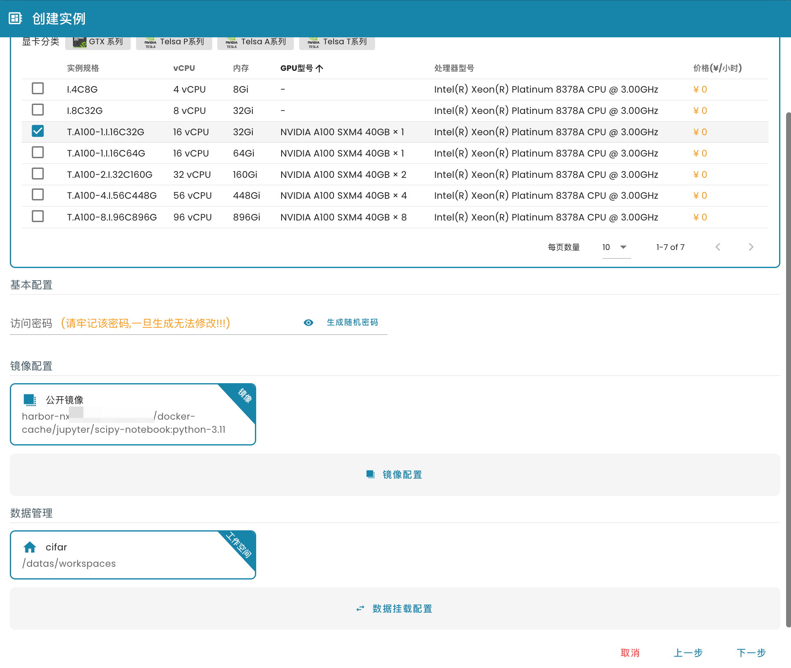

### 第三步 访问Jupyter Notebook

当交互式实例状态为`Running`后，可以点击卡片上的“访问”按钮进行访问实例

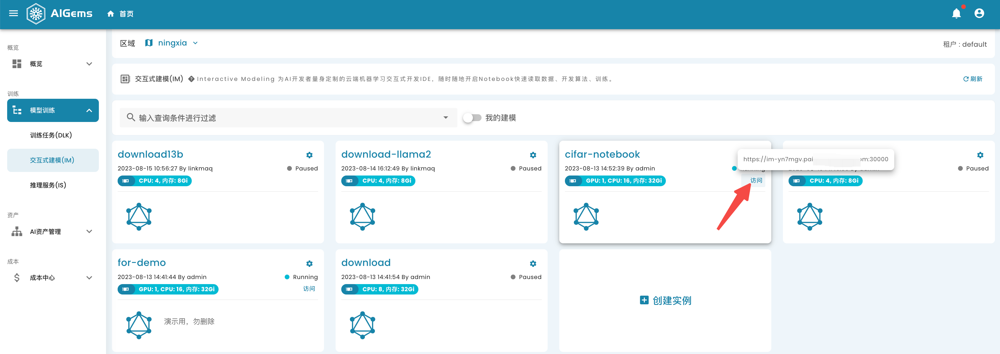

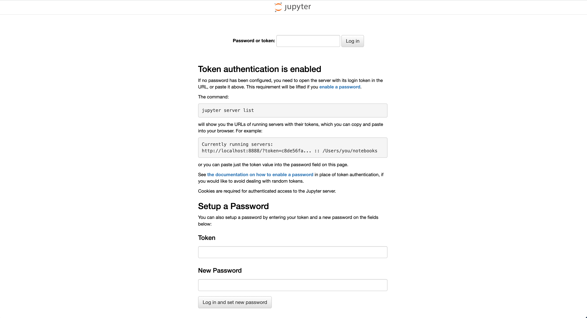

> 如果没有设置 Notebook的访问密码，则Notebook采用Token方式登陆，Token位于实例的启动日志当中
> 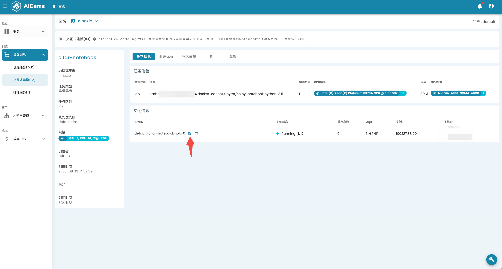
> 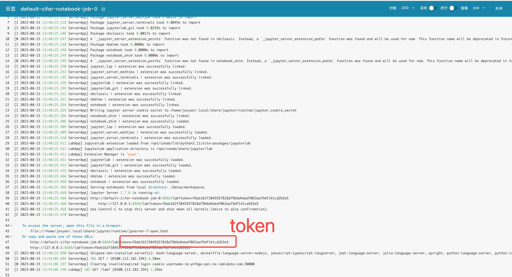

输入Token后，即可进去Notebook的页面

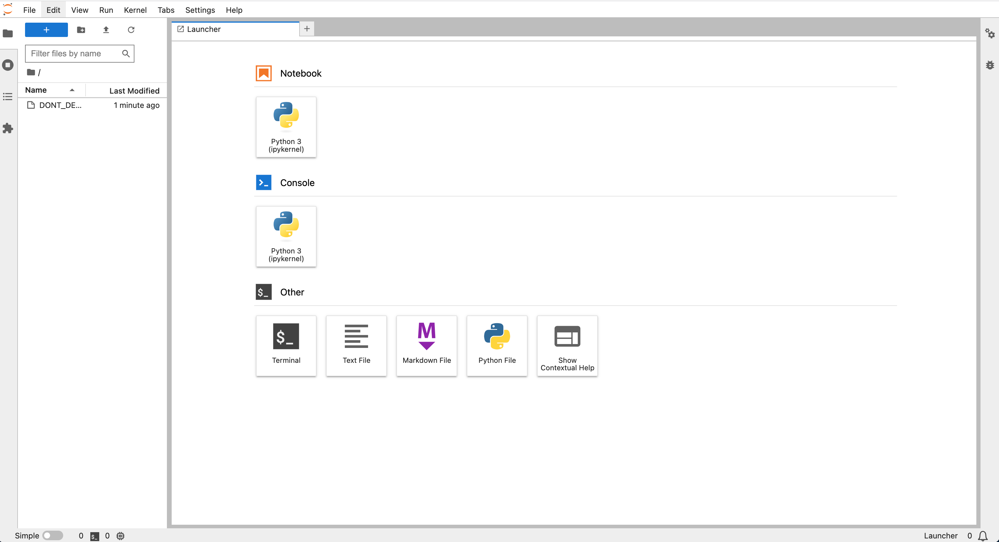

### 第四步 基于Conda初始化开发环境

- 进入到Notebook的 "Terminal" 工具，并 cd 到到个人空间目录（默认挂载路径是/datas/workspaces）

- 使用conda初始化一个python 3.8的环境,并等待conda执行完成

```
$ conda create -p /datas/workspaces/py38 python=3.8
```

- 激活conda环境，并安装conda的jupyter ikernel

```
$ conda activate /datas/workspaces/py38

$ conda install ipykernel
$ python -m ipykernel install --user --name cifar

Installed kernelspec cifar in /home/jovyan/.local/share/jupyter/kernels/cifar
```

### 第五步 上传 cifar10.ipynb

上传 `cifar10.ipynb` 文件后，kernel选择刚刚conda环境中创建的`cifar kernel`

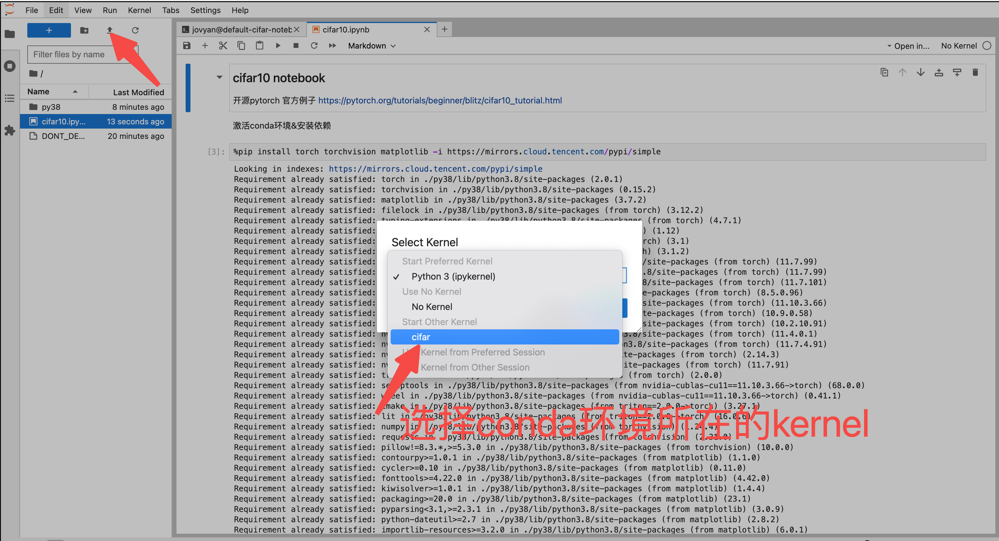

### 第六步 开始开发

此时您在AIGems平台上创建了个人专属的交互式建模实例，您可以根据我们提供的 `cifar.ipynb` 文件进行 step-by-step 执行。

您可以根据ipynb脚本中提供train方法在交互式建模实例中进行简单的train实验和对结果进行简单的预测

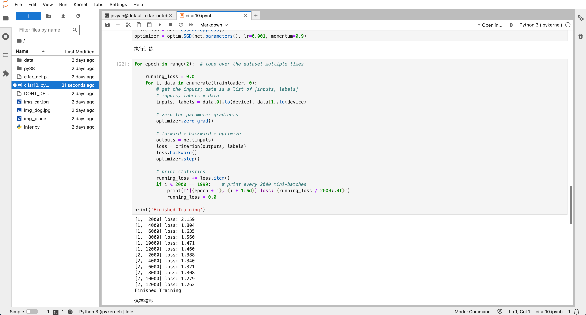
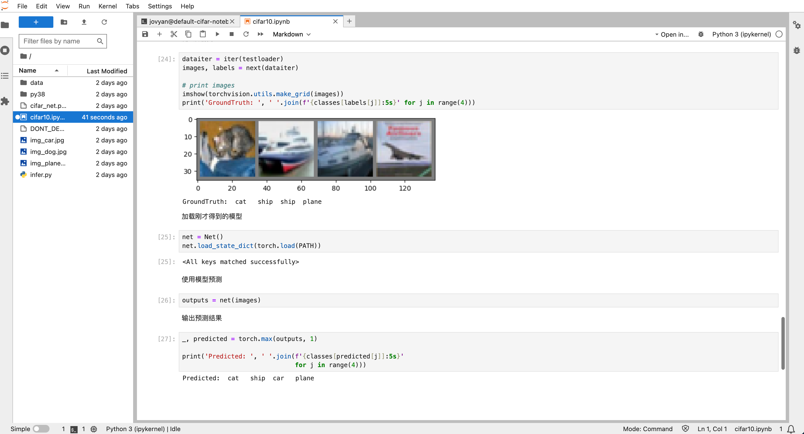

### 第七步 使用flask快速起一个推理服务

- 上传 `infer.py` 文件，进入Notebook的`Ternimal`，执行执行下述命令

```
$ pip install flask
$ python infer.py

 * Serving Flask app 'infer'
 * Debug mode: off
WARNING: This is a development server. Do not use it in a production deployment. Use a production WSGI server instead.
 * Running on http://127.0.0.1:5000
Press CTRL+C to quit
```

- 验证

上传文件 `img_car.jpg`、`img_dog.jpg`、`img_plane.jpg`，并使用 curl 调用简单测试功能

```
$ curl -F "img=@img_dog.jpg" localhost:5000
img content is: dog(base) 
```


```
$ curl -F "img=@img_plane.jpg" localhost:5000
img content is: plane(base) 
```


```
$ curl -F "img=@img_car.jpg" localhost:5000
img content is: car(base)  
```


## 实用的技巧

### 1. 复用 Conda 环境

由于您的 conda 环境安装在您创建的 `个人空间` 中，所以以后您创建的任何训练任务、建模任务和推理任务都可以将该个人空间挂载到任务当中，这样即可以保证您在开发和训练阶段的python环境始终保持一致。 

如果多个任务类型相同，您甚至可以将 `个人空间` 同时挂载给多个任务使用，可极大减少准备python环境的时间